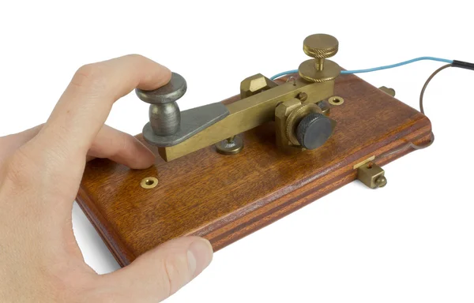

# minitalk
 
This project is the 5th of the 42 School cursus.

# Description
In this project, we must implement two programs, a client and a server. 
The client must send a string to the server, and the server must display it. 
The communication between the two programs must be done using signals. 
